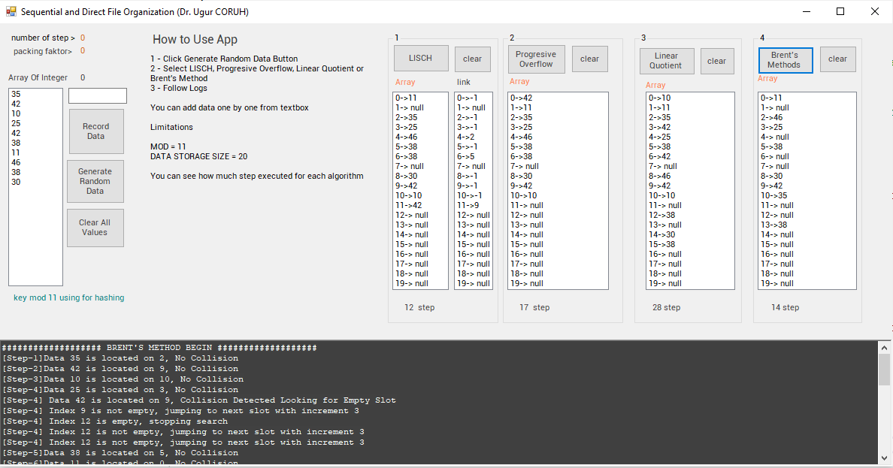

# Sequential and Direct File Organization

This application has demonstration of the following algorithms

- LISCH (Last Insertion Coalesced Hashing)

- Progresive Overflow

- Linear Quotient

- Brent's Method

Application has static 10 byte data buffer and store this data in 20 byte allocated storage. Array size and Storage Size is Constant for Demonstration. 

## LISCH (Last Insertion Coalesced Hashing)

If collision present then algorithms search empty slot from end of list and decrease index for suitable location. First index calculated as follow

```csharp
index =  key  % MOD_SIZE
```

## Progressive Overflow

If collision present then algorithm increase the index `one-by-one`and looks for next empty slot. First index calculated as follow

```csharp
index =  key  % MOD_SIZE
```

## Linear Quotient

If collision present then algorithm increase the position by and the following method

```csharp
step_size = ( key / MOD_SIZE ) % MOD_SIZE
```

and looks for next empty slot. First index calculated as follow

```csharp
index =  key  % MOD_SIZE
```

## Brent's Method

If collision present then algorithm calculates the step_size as follow 

```csharp
step_size = ( key_1 / MOD_SIZE ) % MOD_SIZE
```

then if position in this step is not empty then algorithm calculates the cost of movement of this current collided item to another location and replace with current key. If movement has less step then we replace collision with current key and previous key moved to another location else we continue searching empty slot for current key. 

## Application Interface



1 - Click Generate Random Data Button
2 - Select LISCH, Progresive Overflow, Linear Quotient or Brent's Method
3 - Follow Logs 

You can add data one by one from textbox 

Limitations 

MOD = 11
DATA STORAGE SIZE = 20

You can see how much step executed for each algorithm

for more information visit 

[CE205 Data Structures Week-13 - RTEU CE205 Data Structures Course Notes](https://ucoruh.github.io/ce205-data-structures/week-13-direct-sequential-file/ce205-week-13-direct-sequential-file/)
